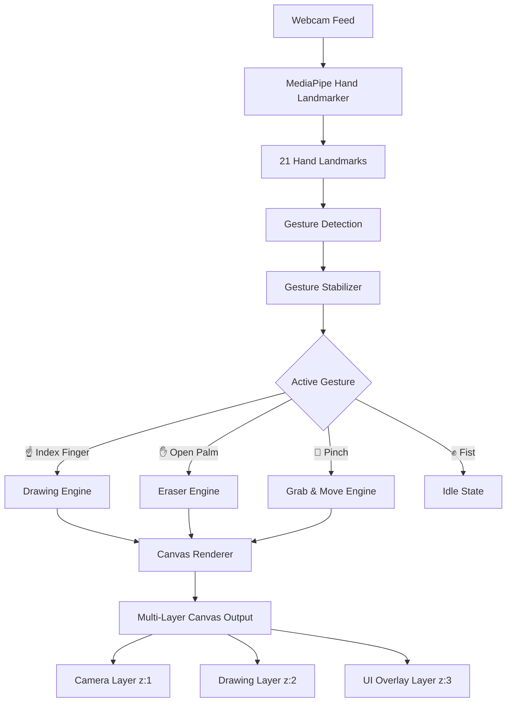

<div align="center">

# ✨ GestDraw

### Draw in the Air with Your Hands

A **gesture-based drawing application** powered by real-time hand tracking.  
No mouse. No stylus. Just your hands and a camera.

[](https://developer.mozilla.org/en-US/docs/Web/JavaScript)
[](https://ai.google.dev/edge/mediapipe/solutions/vision/hand_landmarker)
[](LICENSE)

---

**[🚀 Live Demo](https://gestdraw.netlify.app)** · **[🐛 Report Bug](https://github.com/Dhyan-7/GestDraw/issues)** · **[💡 Request Feature](https://github.com/Dhyan-7/GestDraw/issues)**

</div>

<br/>

## 🎥 How It Works

GestDraw uses **MediaPipe Hand Landmarker** to detect 21 hand landmarks in real-time through your webcam. Each gesture maps to a different creative action — point to draw, open your palm to erase, pinch to grab and move strokes. Everything runs **entirely in the browser** with zero backend.

<br/>

## 🖐️ Gesture Controls

| Gesture | Action | Description |
|:-------:|:------:|:------------|
| ☝️ | **Draw** | Point your index finger to draw glowing strokes on the canvas |
| ✋ | **Erase** | Open your palm and sweep across strokes to erase them |
| 🤏 | **Grab & Move** | Pinch your thumb and index finger to grab the nearest stroke and reposition it |
| ✊ | **Idle** | Close your fist to pause — no accidental marks |

<br/>

## ✨ Features

### 🎨 Creative Tools
- **8 Vibrant Neon Colors** — Cyan, Magenta, Lime, Blue, Pink, Gold, Purple, White
- **Adjustable Brush Thickness** — Fine lines to bold strokes (1–20px)
- **Dynamic Glow Control** — Dial the neon glow from subtle to intense (0–100%)
- **Smooth Bezier Curves** — Quadratic curve interpolation for silky-smooth strokes

### 🖥️ Smart Canvas
- **3-Mode Camera Toggle** — Camera ON → DIM → Dark Canvas for distraction-free drawing
- **Undo Support** — Step back through your stroke history
- **Clear All** — Wipe the canvas clean with one click
- **Export as PNG** — Save your masterpiece with a dark background, ready to share

### 🤖 Advanced Hand Tracking
- **21-Point Hand Skeleton** — Full hand landmark visualization with fingertip highlights
- **Gesture Stabilization** — Multi-frame buffering prevents jittery false triggers
- **Smart Drawing Cursor** — Glowing ring + dot indicator follows your fingertip
- **Grace Period** — 300ms delay on gesture start prevents unwanted initial marks

### 🎭 Visual Polish
- **Glassmorphism UI** — Frosted glass toolbar and HUD with backdrop blur
- **Particle Effects** — Sparkle trail while drawing for a magical feel
- **Neon Glow Rendering** — Multi-pass stroke rendering (outer glow → mid glow → core line)
- **Smooth Animations** — Loading screen, modal transitions, and micro-interactions
- **Audio Feedback** — Subtle tonal cues for draw, erase, grab, and UI actions

### 📱 Responsive Design
- **Adaptive Layout** — Toolbar and UI scale for mobile and desktop
- **Full-Screen Canvas** — Edge-to-edge drawing area, no wasted space
- **Real-Time Resizing** — Canvas and strokes adapt to window changes

<br/>

## 🛠️ Tech Stack

| Technology | Purpose |
|:-----------|:--------|
| **HTML5 Canvas** | Multi-layer rendering (camera, drawing, UI) |
| **Vanilla JavaScript** | Application logic, gesture detection, rendering loop |
| **CSS3** | Glassmorphism, animations, responsive design |
| **MediaPipe Vision** | Real-time hand landmark detection (21 points) |
| **Web Audio API** | Procedural sound effects |
| **Google Fonts** | Inter + Outfit for modern typography |

<br/>

## 🚀 Getting Started

### Prerequisites

- A modern browser (Chrome, Edge, or Firefox recommended)
- A webcam
- Camera permissions enabled

### Run Locally

```bash
# Clone the repository
git clone https://github.com/Dhyan-7/GestDraw.git

# Navigate to the project
cd GestDraw

# Serve with any static server (pick one)
npx serve .
# or
python3 -m http.server 8000
# or
php -S localhost:8000
```

Then open **`http://localhost:3000`** (or the port shown) in your browser.

> [!IMPORTANT]
> The app **must** be served over `localhost` or `HTTPS` for webcam access to work.  
> Opening `index.html` directly via `file://` will not grant camera permissions.

<br/>

## 📁 Project Structure

```
GestDraw/
├── index.html      # App shell, toolbar, onboarding modal
├── app.js          # Core logic — hand tracking, gestures, rendering
├── style.css       # Design system, glassmorphism, animations
└── README.md       # You are here
```

<br/>

## 🏗️ Architecture



<br/>

## 🎯 Browser Compatibility

| Browser | Status |
|:--------|:------:|
| Chrome 90+ | ✅ Full support |
| Edge 90+ | ✅ Full support |
| Firefox 90+ | ✅ Full support |
| Safari 15.4+ | ⚠️ Partial (WebGL required) |
| Mobile Chrome | ✅ Supported |

<br/>

## 🤝 Contributing

Contributions are welcome! Feel free to:

1. **Fork** the repository
2. **Create** a feature branch (`git checkout -b feature/amazing-feature`)
3. **Commit** your changes (`git commit -m 'Add amazing feature'`)
4. **Push** to the branch (`git push origin feature/amazing-feature`)
5. **Open** a Pull Request

<br/>

## 📜 License

This project is licensed under the **MIT License** — see the [LICENSE](LICENSE) file for details.

<br/>

## 🙌 Acknowledgements

- [MediaPipe](https://ai.google.dev/edge/mediapipe/solutions/vision/hand_landmarker) — Hand landmark detection model by Google
- [Google Fonts](https://fonts.google.com/) — Inter & Outfit typefaces

<br/>

---

<div align="center">

**Built with ❤️ by [DHYAN A](https://dhyan.world)**

⭐ Star this repo if you found it interesting!

</div>